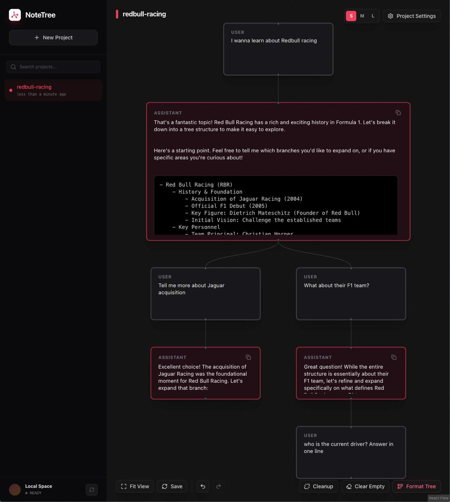

<p align="center">
  
</p>

# NoteTree

Think of NoteTree as a mind map for conversations with AI. Instead of scrolling through endless chat history, you organize your thoughts in a tree structure where each branch is its own conversation thread.



## What is this?

Ever had a conversation with ChatGPT or Claude where you wanted to explore multiple ideas from the same starting point? Or found yourself scrolling up and down trying to remember what you were talking about five messages ago?

NoteTree solves this by letting you branch conversations. Start with a root question, then create child nodes for follow-up questions. Each branch maintains its own context without polluting the others. It's like having multiple chat windows that all remember their parent conversation.

## Why would I use this?

**For learning complex topics:** When you're diving deep into something new, you often need to ask clarifying questions without losing your main thread. With NoteTree, you can branch off to ask "wait, what does that term mean?" and then return to your main conversation without the AI getting confused.

**For research and exploration:** Exploring multiple angles of a problem becomes way easier when you can visualize how your questions relate to each other. Each branch is isolated, so you can try different approaches without context bleeding between them.

**For keeping your sanity:** No more scrolling through massive chat logs trying to find that one thing the AI said 50 messages ago. Your conversation is organized spatially, not just chronologically.

## How it works

- Each node in the tree is a message exchange with the AI
- Child nodes inherit context from their parent lineage (the path from root to that node)
- Sibling branches don't interfere with each other
- You can collapse and expand branches to keep things tidy
- The AI only sees the relevant conversation path, keeping responses focused

## Getting Started

### Prerequisites

- Node.js (v18 or higher)
- pnpm (if you don't have it: `npm install -g pnpm`)

### Installation

```bash
# Clone the repo
git clone https://github.com/yourusername/notetree.git
cd notetree

# Install dependencies
pnpm install

# Set up your environment
cp .env.example .env
# Edit .env and add your Gemini API key

# Run the development server
pnpm dev
```

The app should now be running at `http://localhost:5173` (or whatever port Vite assigns).

### First Steps

1. Create a new project (think of it as a workspace for related conversations)
2. Add your first node - this is your root question or topic
3. Get a response from the AI
4. Click on any message to create a child node and branch the conversation
5. Use the tree view to navigate between different conversation threads

## Features

- **Tree-based conversation structure** - Organize your thoughts hierarchically
- **Context inheritance** - Each node knows its full conversation history
- **Branch isolation** - Explore different ideas without cross-contamination
- **Gemini AI integration** - Powered by Google's Gemini AI
- **Local storage** - Your conversations are saved locally
- **Clean up tools** - Remove empty nodes, format the tree, and keep things organized

## Tech Stack

Built with React, TypeScript, and Vite. Uses Zustand for state management and React Flow for the tree visualization.

## Contributing

This is an open project. If you find bugs or have ideas for improvements, feel free to open an issue or submit a PR.

## License

MIT - do whatever you want with it.
