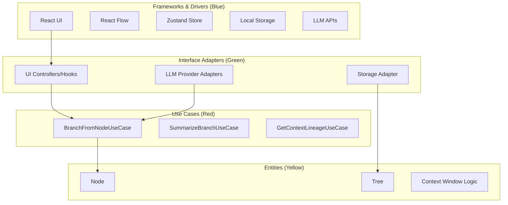
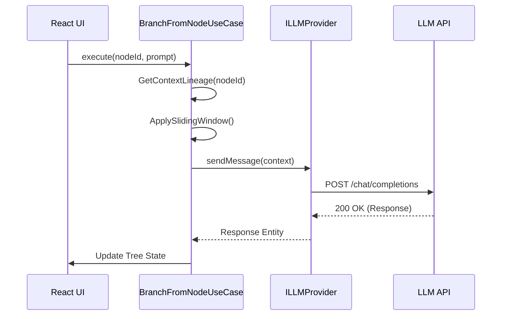

# Technical Design Document (TDD): NoteTree

## 1. Introduction
- **Overview:** NoteTree is a non-linear, tree-based interface for LLM interactions. This document outlines the technical architecture following Clean Architecture and Hexagonal patterns to ensure maintainability, testability, and decoupling from UI and external APIs.
- **Scope:** Covers core domain logic, state management, LLM integration strategy, and UI component architecture.
- **References:** [docs/prd.md](docs/prd.md)

## 2. Architectural Overview
### 2.1. System Architecture
NoteTree follows **Clean Architecture** principles. The system is organized into concentric layers where dependencies only point inward.



### 2.2. Technology Stack
- **Frontend:** React (TypeScript)
- **Visualization:** React Flow (for DAG rendering and viewport virtualization)
- **State Management:** Zustand (for flat state and high-performance updates)
- **External APIs:** OpenAI/Gemini (via modular adapters)
- **Local Persistence:** Browser `localStorage` or `IndexedDB`

## 3. Detailed Design (Clean Architecture Layers)

### 3.1. Entities (Domain Layer)
The core business logic is independent of frameworks.
- **`Node`**: Represents a single exchange (User Prompt + Assistant Response). Includes metadata like `id`, `parentId`, `color`, and `summary`.
- **`Tree`**: A flat Map of `nodes` representing a DAG. Contains methods for traversing lineages.
- **Context Logic**: Pure functions to calculate the "Ancestor Sliding Window" (Root + last N ancestors).

### 3.2. Use Cases (Application Layer)
Application-specific business rules that orchestrate the flow of data.
- **`BranchFromNodeUseCase`**: Triggered when a user creates a new branch. It fetches context from ancestors, constructs the prompt, calls the LLM, and updates the tree.
- **`SummarizeBranchUseCase`**: Collapses a branch and generates a summary node while preserving child data.
- **`GetContextLineageUseCase`**: Retrieves the sequence of messages from the root to the current node, applying the sliding window policy.

### 3.3. Interface Adapters (Ports & Adapters)
- **Ports (Interfaces):**
    - `ILLMProvider`: Defines `sendMessage(messages: Message[]): Promise<Response>`.
    - `ITreeRepository`: Defines `saveTree(tree: Tree)` and `loadTree()`.
- **Adapters (Implementations):**
    - `OpenAIAdapter`: Maps internal `Message` entities to OpenAI's API format.
    - `LocalStorageRepository`: Handles serialization of the tree to browser storage.

### 3.4. Frameworks & Drivers
- **React Flow Integration**: A custom hook `useTreeLayout` will map the domain `Tree` to React Flow `nodes` and `edges`.
- **Zustand Store**: Acts as the "source of truth" for the UI, holding the flat node map and active focus state.

## 4. Data Design
### 4.1. Data Models (Flat DAG)
```typescript
interface NoteNode {
  id: string;
  parentId: string | null;
  children: string[]; // Child IDs
  role: 'user' | 'assistant';
  content: string;
  summary?: string;
  color?: string;
  isCollapsed: boolean;
  timestamp: number;
}

interface NoteTree {
  id: string;
  rootId: string;
  nodes: Record<string, NoteNode>;
}
```

### 4.2. State Management
The Zustand store will be divided into slices:
- `TreeSlice`: Handles node creation, deletion, and updates.
- `UISlice`: Handles zoom levels, active lineage (for ghosting), and color selections.
- `ConfigSlice`: Handles API keys and model selection.

## 5. API Design
### 5.1. LLM Integration (Sliding Window Strategy)
To optimize tokens and maintain focus:
1. **Always Include:** The "Root" node (first prompt/response) for high-level goal alignment.
2. **Dynamic Window:** The most recent $N$ ancestor nodes.
3. **Summarized Ancestors:** If the total tokens exceed 80% of the model's limit, the oldest nodes (excluding Root) are replaced by their `summary` field.



## 6. Component Design (Frontend)
- **`TreeCanvas`**: The main React Flow wrapper.
- **`ChatNode`**: Custom React Flow node component rendering the message and branching controls.
- **`BreadcrumbBar`**: Interactive component showing the current path.
- **`FocusOverlay`**: CSS-based layer that "ghosts" (dims) inactive nodes based on the current selection.

## 7. Performance & Scalability
- **Viewport Virtualization**: React Flow handles rendering only visible nodes.
- **Flat State Updates**: Using partial updates in Zustand ensures that adding a node doesn't trigger a re-render of the entire tree.

## 8. Security & Privacy
- **Local-Only Keys**: API keys are stored in `localStorage` and never transmitted to any NoteTree backend.
- **No Analytics**: User data and conversation trees remain on the client side.

## 9. Testing Strategy
- **Unit Tests (Jest)**: 100% coverage for `Entities` (tree traversal) and `Use Cases` (sliding window logic).
- **Mocking (msw)**: Mock LLM API responses for integration testing of `Adapters`.
- **Component Tests (React Testing Library)**: Verify node creation and branching triggers.

## 10. Implementation Plan
- **Phase 1: Core Domain**: Implement `Node` and `Tree` entities with basic unit tests. Setup Zustand store.
- **Phase 2: Tree Visualization**: Integrate React Flow with the flat DAG model. Implement basic pan/zoom.
- **Phase 3: Branching & LLM**: Implement the `ILLMProvider` port and `BranchFromNodeUseCase`. Add OpenAI adapter.
- **Phase 4: Workspace Optimization**: Implement Folding, Ghosting (Focus Mode), and Summarization.
